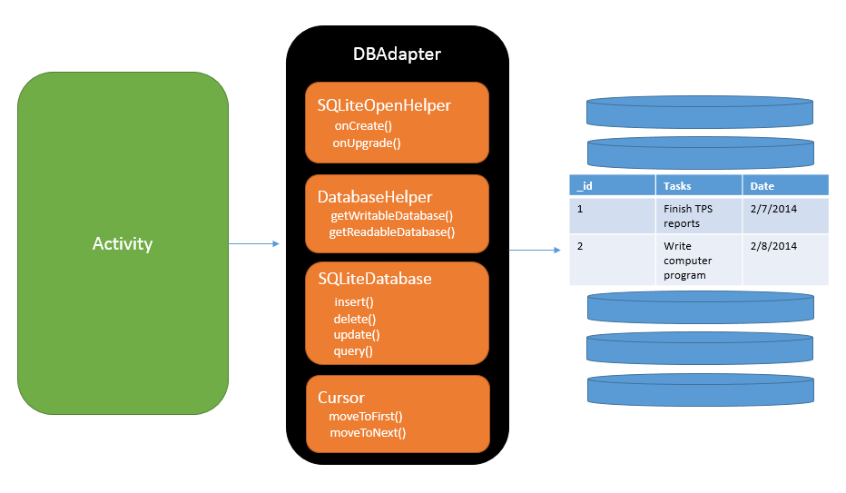

> Para hacer uso de sqlite necesitamos de de unas clases para poder realizar las acciones necesarias. Entonces comenzaremos por ver cual es el que usaremos primero, claro está que al crear el proyecto ya tendremos la clase **MainActivity.java** y el **activity_main.xml** una vez aclarado esto, comenzamos.

> Esta estructura está basado en la documentacion oficial de android developes.

>Bien comenzamos con la definicion de nuestra clase que contendrá el nombre de nuestra tabla o tablas y sus respectivas columnas, todos estos serán nuestras constantes a la cual se le menciona en la documentación como `Contrato`, para este ejercicio se va a crear una tabla **Empleado** con las siguientes columnas.
- id
- nombre
- apellidos
- direccion
- telefono
- edad
- antigüedad
- salario

## ReaderContract.java
```
   1   │ package com.example.exam;
   2   │ 
   3   │ 
   4   │ import android.provider.BaseColumns;
   5   │ 
   6   │ public final class ReaderContract {
   7   │ 
   8   │     public static class ContractEntries implements BaseColumns {
   9   │         public static final String TABLE_EMPLEADO = "empleado";
  10   │ 
  11   │         public static final String COLUMN_NUMERO_EMPLEADO = "id";
  12   │         public static final String COLUMN_NOMBRE_EMPLEADO = "nombre";
  13   │         public static final String COLUMN_APELLIDOS_EMPLEADO="apellidos";
  14   │         public static final String COLUMN_DIRECCION_EMPLEADO="direccion";
  15   │         public static final String COLUMN_TELEFONO_EMPLEADO ="telefono";
  16   │         public static final String COLUMN_EDAD_EMPLEADO ="edad";
  17   │         public static final String COLUMN_ANTIGUEDAD_EMPLEADO ="antiguedad";
  18   │         public static final String COLUMN_SALARIO_EMPLEADO ="salario";
  19   │ 
  20   │     }
  21   │ }
```
> Estas constante nos servirán para no olvidarnos de los nombres de los campos que estaremos utilizand e incluso nos evitarán errores al momento de crear la tabla, insertar, consultar, editar o eliminar los datos porque los tendremos bien referenciados.

> Despues de eso vamos a crear una clase que herede de **SQLiteOpenHelper**, este nos ayudará a crear nuestra base de datos local así como las tablas y sus respectivas columnas.

```
  public class EmpleadoHelper extends SQLiteOpenHelper
```

> **Nota:** En EmpleadoHelper.java es donde comenzamos a usar nuestros constantes, entonces para no tener problemas es mejor importar la clase de la siguiente manera:
```
  import com.example.exam.ReaderContract.ContractEntries;
```
> Despues de importar la clase, ya es posible hacer uso de nuestras constantes sin problemas.

> Para hacer la sentencia `SQL_CREATE_ENTRIES`, para no equivocarme primero cree la sentencia completa sin usar las constantes, quedando la sentencia inicialmente como:

```
"CREATE TABLE empleado (id INTEGER PRIMARY KEY, apellidos TEXT, nombre TEXT, direccion TEXT, telefono  TEXT, edad INTEGER, antiguedad DOUBLE, salario DOUBLE)"
```
> Para despues ir reemplazando los campos con las constantes de la clase ```ContractEntries```

## EmpleadoHelper.java
```
package com.example.exam;
   2   │ 
   3   │ import android.content.Context;
   4   │ import android.database.sqlite.SQLiteDatabase;
   5   │ import android.database.sqlite.SQLiteOpenHelper;
   6   │ import com.example.exam.ReaderContract.ContractEntries;
   7   │ 
   8   │ public class EmpleadoHelper extends SQLiteOpenHelper {
   9   │ 
  10   │     public static final int DATABASE_VERSION = 1; //Definimos la vesión de la Base de datos
  11   │     public static final String DATABASE_NAME = "patito.db"; //Definimos el nombre de la base de datos
  12   │ 
  13   │     private static final String SQL_CREATE_ENTRIES = "CREATE TABLE "+ ContractEntries.TABLE_EMPLEADO +" ("
  14   │             +ContractEntries.COLUMN_NUMERO_EMPLEADO+" INTEGER  PRIMARY KEY , "
  15   │             +ContractEntries.COLUMN_APELLIDOS_EMPLEADO+" TEXT, "
  16   │             +ContractEntries.COLUMN_NOMBRE_EMPLEADO+" TEXT, "
  17   │             +ContractEntries.COLUMN_DIRECCION_EMPLEADO+" TEXT, "
  18   │             +ContractEntries.COLUMN_TELEFONO_EMPLEADO+"  TEXT,"
  19   │             +ContractEntries.COLUMN_EDAD_EMPLEADO+" INTEGER, "
  20   │             +ContractEntries.COLUMN_ANTIGUEDAD_EMPLEADO+" DOUBLE, "
  21   │             +ContractEntries.COLUMN_SALARIO_EMPLEADO+" DOUBLE)";
  22   │ 
  23   │     private static final String SQL_DELETE_ENTRIES =
  24   │             "DROP TABLE IF EXISTS " + ContractEntries.TABLE_EMPLEADO;
  25   │     public EmpleadoHelper (Context context){ //Pedimos el contexto
  26   │         super(context,DATABASE_NAME,null,DATABASE_VERSION); //Le pasamos a la super clase el contexto, Nombre de la BD, el factory va en null y por último la version de la BD
  27   │     }
  28   │
  29   │     @Override
  30   │     public void onCreate(SQLiteDatabase db) {
  31   │         db.execSQL(SQL_CREATE_ENTRIES); //Aquì creamos la tabla
  32   │     }
  33   │ 
  34   │     @Override
  35   │     public void onUpgrade(SQLiteDatabase db, int i, int i1) {
  36   │         db.execSQL(SQL_DELETE_ENTRIES); // Borramos la tabla si existe
  37   │         onCreate(db); // y llamamos a onCreate para subir de versión
  38   │     }
  39   │ }
```
<br>

> También creé una clase **Empleado** para poder crear objetos y manipular mejor la información ahorramdome el `split` para las cadenas, agragandole su constructor y encapsulando sus atributos.

## Empleado.java
```
   1   │ package com.example.exam;
   2   │ 
   3   │ public class Empleado {
   4   │     private int id;
   5   │     private String apellidos;
   6   │     private String nombre;
   7   │     private String direccion;
   8   │     private String telefono;
   9   │     private int edad;
  10   │     private double antiguedad;
  11   │     private double salario;
  12   │ 
  13   │     public Empleado(int id, String apellidos, String nombre, String direccion, String telefono, int edad, double antigued
       │ ad, double salario) {
  14   │         this.id = id;
  15   │         this.apellidos = apellidos;
  16   │         this.nombre = nombre;
  17   │         this.direccion = direccion;
  18   │         this.telefono = telefono;
  19   │         this.edad = edad;
  20   │         this.antiguedad = antiguedad;
  21   │         this.salario = salario;
  22   │     }
  23   │ 
  24   │     public int getId() {return id;}
  25   │     public void setId(int id) {this.id = id;}
  26   │     public String getApellidos() {return apellidos;}
  27   │     public void setApellidos(String apellidos) {this.apellidos = apellidos;}
  28   │     public String getNombre() {return nombre;}
  29   │     public void setNombre(String nombre) {this.nombre = nombre;}
  30   │     public String getDireccion() {return direccion;
  31   │     public void setDireccion(String direccion) {this.direccion = direccion;}
  32   │     public String getTelefono() {return telefono;}
  33   │     public void setTelefono(String telefono) {this.telefono = telefono;}
  34   │     public int getEdad() {return edad;}
  35   │     public void setEdad(int edad) {this.edad = edad;}
  36   │     public double getAntiguedad() {return antiguedad;}
  37   │     public void setAntiguedad(double antiguedad) {this.antiguedad = antiguedad;}
  38   │     public double getSalario() {return salario;}
  39   │     public void setSalario(double salario) {this.salario = salario;}
  40   │ }
```
> Una vez teniendo estos elémentos, es hora de hacer cosillas en el **MainActivity.java**
<br>
> En el `MainActivity` vamos a instanciar el `EmpleadoHelper`, declarandolo primero

  ``` EmpleadoHelper helper; ```
>  y en el constructor instanciarlo.

```
helper = new EmpleadoHelper(this); //recuerdemos que solo le pasamos el contexto
```

## Botón Agregar
> 

```
           btnAgregar.setOnClickListener(view -> {
               String name,last_name,direction,phone;
               int id,age;
               double labor_old,salary;
   
               id =Integer.parseInt(txtId.getText().toString());
               name =txtName.getText().toString();
               last_name = txtLastName.getText().toString();
               direction =txtDirection.getText().toString();
               phone = txtPhone.getText().toString();
               age = Integer.parseInt(txtAge.getText().toString());
               labor_old = Double.parseDouble(txtLabor_Old.getText().toString());
               salary = Double.parseDouble(txtSalary.getText().toString());
   
               SQLiteDatabase db = helper.getWritableDatabase();
               ContentValues values = new ContentValues();
   
               values.put(ContractEntries.COLUMN_NUMERO_EMPLEADO,id);
               values.put(ContractEntries.COLUMN_APELLIDOS_EMPLEADO,last_name);
               values.put(ContractEntries.COLUMN_NOMBRE_EMPLEADO,name);
               values.put(ContractEntries.COLUMN_DIRECCION_EMPLEADO,direction);
               values.put(ContractEntries.COLUMN_TELEFONO_EMPLEADO,phone);
               values.put(ContractEntries.COLUMN_EDAD_EMPLEADO,age);
               values.put(ContractEntries.COLUMN_ANTIGUEDAD_EMPLEADO,labor_old);
               values.put(ContractEntries.COLUMN_SALARIO_EMPLEADO,salary);
   
               long newRowId = db.insert(ContractEntries.TABLE_EMPLEADO, null, values);
               Toast.makeText(MainActivity.this, "-> "+ newRowId, Toast.LENGTH_SHORT).show();
   
           });
```

## Botón Consultar
```
           btnConsultar.setOnClickListener(new View.OnClickListener() {
               @Override
               public void onClick(View view) {
                   Intent intent = new Intent(MainActivity.this, Listado.class);
                   startActivity(intent);
               }
           });
```

> Asì se veria completamente en la clase `MainActivity`

## MainActivity.java
```
   1   │ package com.example.exam;
   2   │ 
   3   │ import androidx.appcompat.app.AppCompatActivity;
   4   │ 
   5   │ import android.annotation.SuppressLint;
   6   │ import android.content.ContentValues;
   7   │ import android.content.Intent;
   8   │ import android.database.Cursor;
   9   │ import android.database.sqlite.SQLiteDatabase;
  10   │ import android.os.Bundle;
  11   │ import android.view.View;
  12   │ import android.widget.ArrayAdapter;
  13   │ import android.widget.Button;
  14   │ import android.widget.EditText;
  15   │ import android.widget.Toast;
  16   │ 
  17   │ import com.example.exam.ReaderContract.ContractEntries;
  18   │ 
  19   │ import java.util.ArrayList;
  20   │ 
  21   │ public class MainActivity extends AppCompatActivity {
  22   │     private Button btnAgregar,btnConsultar;
  23   │     private EditText txtId,txtName,txtLastName,txtDirection,txtPhone,txtAge,txtLabor_Old,txtSalary;
  24   │ 
  25   │ 
  26   │     EmpleadoHelper helper;
  27   │     @Override
  28   │     protected void onCreate(Bundle savedInstanceState) {
  29   │         super.onCreate(savedInstanceState);
  30   │         setContentView(R.layout.activity_main);
  31   │ 
  32   │ 
  33   │         btnAgregar = findViewById(R.id.btnAgregar);
  34   │         btnConsultar = findViewById(R.id.btnConsultar);
  35   │ 
  36   │         txtId = findViewById(R.id.txtId);
  37   │         txtName = findViewById(R.id.txtNombre);
  38   │         txtLastName = findViewById(R.id.txtApellidos);
  39   │         txtDirection = findViewById(R.id.txtDireccion);
  40   │         txtPhone = findViewById(R.id.txtTelefono);
  41   │         txtAge = findViewById(R.id.txtEdad);
  42   │         txtLabor_Old = findViewById(R.id.txtAntiguedad);
  43   │         txtSalary = findViewById(R.id.txtSalario);
  44   │ 
  45   │         helper = new EmpleadoHelper(this);
  46   │ 
  47   │         btnAgregar.setOnClickListener(view -> {
  48   │             String name,last_name,direction,phone;
  49   │             int id,age;
  50   │             double labor_old,salary;
  51   │ 
  52   │             id =Integer.parseInt(txtId.getText().toString());
  53   │             name =txtName.getText().toString();
  54   │             last_name = txtLastName.getText().toString();
  55   │             direction =txtDirection.getText().toString();
  56   │             phone = txtPhone.getText().toString();
  57   │             age = Integer.parseInt(txtAge.getText().toString());
  58   │             labor_old = Double.parseDouble(txtLabor_Old.getText().toString());
  59   │             salary = Double.parseDouble(txtSalary.getText().toString());
  60   │ 
  61   │             SQLiteDatabase db = helper.getWritableDatabase();
  62   │             ContentValues values = new ContentValues();
  63   │ 
  64   │             values.put(ContractEntries.COLUMN_NUMERO_EMPLEADO,id);
  65   │             values.put(ContractEntries.COLUMN_APELLIDOS_EMPLEADO,last_name);
  66   │             values.put(ContractEntries.COLUMN_NOMBRE_EMPLEADO,name);
  67   │             values.put(ContractEntries.COLUMN_DIRECCION_EMPLEADO,direction);
  68   │             values.put(ContractEntries.COLUMN_TELEFONO_EMPLEADO,phone);
  69   │             values.put(ContractEntries.COLUMN_EDAD_EMPLEADO,age);
  70   │             values.put(ContractEntries.COLUMN_ANTIGUEDAD_EMPLEADO,labor_old);
  71   │             values.put(ContractEntries.COLUMN_SALARIO_EMPLEADO,salary);
  72   │ 
  73   │             long newRowId = db.insert(ContractEntries.TABLE_EMPLEADO, null, values);
  74   │             Toast.makeText(MainActivity.this, "-> "+ newRowId, Toast.LENGTH_SHORT).show();
  75   │ 
  76   │         });
  77   │         btnConsultar.setOnClickListener(new View.OnClickListener() {
  78   │             @Override
  79   │             public void onClick(View view) {
  80   │                 Intent intent = new Intent(MainActivity.this, Listado.class);
  81   │                 startActivity(intent);
  82   │             }
  83   │         });
  84   │     }
  85   │ 
  86   │ 
  87   │ }
```
<br>
# Listado
> En esta clase, se define el evento clic de los `items` de la lista, para que cada que seleccionemos un elemento, nos redirija otro activity en donde podamos `Eliminar` y `Editar`.

### Evento click
```
           lstListado.setOnItemClickListener((adapterView, view, position, id) -> {
               String name, last_name, direction, phone;
               int id_em, age;
               double labor_old, salary;
               name = listaEmpleado.get(position).getNombre();
               last_name = listaEmpleado.get(position).getApellidos();
               direction = listaEmpleado.get(position).getDireccion();
               phone = listaEmpleado.get(position).getTelefono();
               id_em = listaEmpleado.get(position).getId();
               age = listaEmpleado.get(position).getEdad();
               labor_old = listaEmpleado.get(position).getAntiguedad();
               salary = listaEmpleado.get(position).getSalario();
   
               Intent intent = new Intent(Listado.this, Edit_Delete.class);
               intent.putExtra("id", id_em);
               intent.putExtra("name", name);
               intent.putExtra("last_name", last_name);
               intent.putExtra("direction", direction);
               intent.putExtra("phone", phone);
               intent.putExtra("age", age);
               intent.putExtra("labor_old", labor_old);
               intent.putExtra("salary", salary);
               startActivity(intent);
           });
```
## Listado.java 
> Clase en donde listamos todos los datos, para poder visulizarlos y al darle clic poder obtener los datos, poder editarlos o eliminarlos.

```
   1   │ package com.example.exam;
   2   │ 
   3   │ import androidx.appcompat.app.AppCompatActivity;
   4   │ 
   5   │ import android.annotation.SuppressLint;
   6   │ import android.content.Intent;
   7   │ import android.database.Cursor;
   8   │ import android.database.sqlite.SQLiteDatabase;
   9   │ import android.os.Bundle;
  10   │ import android.view.View;
  11   │ import android.widget.AdapterView;
  12   │ import android.widget.ArrayAdapter;
  13   │ import android.widget.Button;
  14   │ import android.widget.ListView;
  15   │ import android.widget.Toast;
  16   │ 
  17   │ import com.example.exam.ReaderContract.ContractEntries;
  18   │ 
  19   │ import java.util.ArrayList;
  20   │ 
  21   │ public class Listado extends AppCompatActivity {
  22   │ 
  23   │     private ListView lstListado;
  24   │ 
  25   │     ArrayList<String> listado;  //Inicializo un ArrayList de tipo String
  26   │     ArrayList<Empleado> listaEmpleado; //Inicializo un ArrayList de tipo empleado
  27   │     EmpleadoHelper helper;  //Inicializo otra vez un helper de tipo EmpleadoHelper
  28   │     ArrayAdapter adapter; //Un adaptador de tipo ArrayAdapter para pasarlo a un listview
  29   │ 
  30   │     private Button btnOrden,btnNomina,btnSueldo,btnPromedio;
  31   │     @Override
  32   │     protected void onCreate(Bundle savedInstanceState) {
  33   │         super.onCreate(savedInstanceState);
  34   │         setContentView(R.layout.activity_listado);
  35   │ 
  36   │         btnOrden = findViewById(R.id.btnOrden);
  37   │         btnNomina = findViewById(R.id.btnNomina);
  38   │         btnSueldo = findViewById(R.id.btnSueldo);
  39   │         btnPromedio = findViewById(R.id.btnPromedio);
  40   │         lstListado = findViewById(R.id.lstListado);
  41   │         helper = new EmpleadoHelper(this); // Instancia del helper
  42   │ 
  43   │         lstListado = findViewById(R.id.lstListado);
  44   │         lstListado.setOnItemClickListener((adapterView, view, position, id) -> {
  45   │             String name, last_name, direction, phone;
  46   │             int id_em, age;
  47   │             double labor_old, salary;
  48   │             name = listaEmpleado.get(position).getNombre();
  49   │             last_name = listaEmpleado.get(position).getApellidos();
  50   │             direction = listaEmpleado.get(position).getDireccion();
  51   │             phone = listaEmpleado.get(position).getTelefono();
  52   │             id_em = listaEmpleado.get(position).getId();
  53   │             age = listaEmpleado.get(position).getEdad();
  54   │             labor_old = listaEmpleado.get(position).getAntiguedad();
  55   │             salary = listaEmpleado.get(position).getSalario();
  56   │ 
  57   │             Intent intent = new Intent(Listado.this, Edit_Delete.class);
  58   │             intent.putExtra("id", id_em);
  59   │             intent.putExtra("name", name);
  60   │             intent.putExtra("last_name", last_name);
  61   │             intent.putExtra("direction", direction);
  62   │             intent.putExtra("phone", phone);
  63   │             intent.putExtra("age", age);
  64   │             intent.putExtra("labor_old", labor_old);
  65   │             intent.putExtra("salary", salary);
  66   │             startActivity(intent);
  67   │         });
  68   │         actualizar();
  69   │     }
  70   │ 
  71   │     @SuppressLint("Range")
  72   │     private ArrayList<String> lista() {
  73   │         ArrayList<String> datos; //declaro un arrayList de tipo de String 
  74   │ 
  75   │         SQLiteDatabase db = helper.getReadableDatabase(); // Se inicializa la conexion a la bd con el helper de tipo lectura
  76   │         Cursor cursor = db.query(               //Con el cursor hacemos una query
  77   │                 ContractEntries.TABLE_EMPLEADO, //Pasamo el nombre de la tabla
  78   │                 null,                           //pasamos null para traer todas las columnas
  79   │                 null,                            //null para la opcion del where
  80   │                 null,                             // null para los argumentos del where
  81   │                 null,                            //Sin agrupamiento
  82   │                 null,                             //Sin filtrado
  83   │                 null                               //son ordenamiento
  84   │         );
  85   │         datos = new ArrayList<>();
  86   │         while (cursor.moveToNext()) {
  87   │             String dato = "";
  88   │             String name, last_name, direction, phone;
  89   │             int id, age;
  90   │             double labor_old, salary;
  91   │ 
  92   │             id = cursor.getInt(cursor.getColumnIndex(ContractEntries.COLUMN_NUMERO_EMPLEADO));
  93   │             name = cursor.getString(cursor.getColumnIndex(ContractEntries.COLUMN_NOMBRE_EMPLEADO));
  94   │             last_name = cursor.getString(cursor.getColumnIndex(ContractEntries.COLUMN_APELLIDOS_EMPLEADO));
  95   │             direction = cursor.getString(cursor.getColumnIndex(ContractEntries.COLUMN_DIRECCION_EMPLEADO));
  96   │             phone = cursor.getString(cursor.getColumnIndex(ContractEntries.COLUMN_TELEFONO_EMPLEADO));
  97   │             age = cursor.getInt(cursor.getColumnIndex(ContractEntries.COLUMN_EDAD_EMPLEADO));
  98   │             labor_old = cursor.getDouble(cursor.getColumnIndex(ContractEntries.COLUMN_ANTIGUEDAD_EMPLEADO));
  99   │             salary = cursor.getDouble(cursor.getColumnIndex(ContractEntries.COLUMN_SALARIO_EMPLEADO));
 100   │ 
 101   │             dato = "ID: " + id + " Nombre: " + name + " Apellido: " +
 102   │                     last_name + " Direccion: " + direction + " Telefono: "
 103   │                     + phone + " Edad: " + age + " Antiguedad: " + labor_old + " Salario: " + salary;
 104   │             listaEmpleado.add(new Empleado(id, last_name, name, direction, phone, age, labor_old, salary));
 105   │             datos.add(dato);
 106   │         }
 107   │         cursor.close();
 108   │         return datos;
 109   │     }
 110   │ 
 111   │     private void actualizar() {
 112   │         listado = new ArrayList<>();
 113   │         listaEmpleado = new ArrayList<>();
 114   │         listado = lista();
 115   │         adapter = new ArrayAdapter(this, android.R.layout.simple_list_item_1, listado);
 116   │         lstListado.setAdapter(adapter);
 117   │ 
 118   │         btnOrden.setOnClickListener(v -> {
 119   │             listado = new ArrayList<>();
 120   │             listaEmpleado = new ArrayList<>();
 121   │             listado = ordenar();
 122   │             adapter = new ArrayAdapter(getApplicationContext(), android.R.layout.simple_list_item_1, listado);
 123   │             lstListado.setAdapter(adapter);
 124   │         });
 125   │ 
 126   │         btnPromedio.setOnClickListener(v -> promedio());
 127   │         btnSueldo.setOnClickListener(v -> salarioMayor());
 128   │         btnNomina.setOnClickListener(v -> nomina());
 129   │     }
 130   │     private void promedio()
 131   │     {
 132   │         ArrayList<String> datos;
 133   │ 
 134   │         String [] columnsGet = {"AVG("+ContractEntries.COLUMN_EDAD_EMPLEADO+" )", ContractEntries.COLUMN_NOMBRE_EMPLEADO}
       │ ;
 135   │         SQLiteDatabase db = helper.getReadableDatabase();
 136   │         Cursor cursor = db.query(
 137   │                 ContractEntries.TABLE_EMPLEADO,
 138   │                 columnsGet,
 139   │                 null,
 140   │                 null,
 141   │                 null,
 142   │                 null,
 143   │                 null
 144   │         );
 145   │         datos = new ArrayList<>();
 146   │         while (cursor.moveToNext()) {
 147   │             int age = cursor.getInt(0);
 148   │             datos.add(String.valueOf(age));
 149   │         }
 150   │         cursor.close();
 151   │         Toast.makeText(this, "Promedio -->" + datos.get(0).toString(), Toast.LENGTH_LONG).show();
 152   │ 
 153   │     }
 154   │     private ArrayList<String> ordenar()
 155   │     {
 156   │         ArrayList<String> datos;
 157   │ 
 158   │         String [] columnsGet = {ContractEntries.COLUMN_NOMBRE_EMPLEADO};
 159   │         String order = ContractEntries.COLUMN_NOMBRE_EMPLEADO + " ASC";
 160   │         SQLiteDatabase db = helper.getReadableDatabase();
 161   │         Cursor cursor = db.query(
 162   │                 ContractEntries.TABLE_EMPLEADO,
 163   │                 columnsGet,
 164   │                 null,
 165   │                 null,
 166   │                 null,
 167   │                 null,
 168   │                 order
 169   │         );
 170   │ 
 171   │         datos = new ArrayList<>();
 172   │         while (cursor.moveToNext()) {
 173   │ 
 174   │             String name = cursor.getString(0);
 175   │             datos.add(name);
 176   │         }
 177   │         cursor.close();
 178   │ 
 179   │         return datos;
 180   │     }
 181   │     private void salarioMayor()
 182   │     {
 183   │         ArrayList<String> datos;
 184   │ 
 185   │         String [] columnsGet = {"MAX("+ContractEntries.COLUMN_SALARIO_EMPLEADO+" )", ContractEntries.COLUMN_NOMBRE_EMPLEA
       │ DO};
 186   │         SQLiteDatabase db = helper.getReadableDatabase();
 187   │         Cursor cursor = db.query(
 188   │                 ContractEntries.TABLE_EMPLEADO,
 189   │                 columnsGet,
 190   │                 null,
 191   │                 null,
 192   │                 null,
 193   │                 null,
 194   │                 null
 195   │         );
 196   │         datos = new ArrayList<>();
 197   │         while (cursor.moveToNext()) {
 198   │             int age = cursor.getInt(0);
 199   │             String n = cursor.getString(1);
 200   │             datos.add(age + " : "+ n);
 201   │         }
 202   │         cursor.close();
 203   │         Toast.makeText(this, "-->" + datos.get(0).toString(), Toast.LENGTH_LONG).show();
 204   │ 
 205   │     }
 206   │     private void nomina()
 207   │     {
 208   │         ArrayList<String> datos;
 209   │ 
 210   │         String [] columnsGet = {"SUM("+ContractEntries.COLUMN_SALARIO_EMPLEADO+" )"};
 211   │         SQLiteDatabase db = helper.getReadableDatabase();
 212   │         Cursor cursor = db.query(
 213   │                 ContractEntries.TABLE_EMPLEADO,
 214   │                 columnsGet,
 215   │                 null,
 216   │                 null,
 217   │                 null,
 218   │                 null,
 219   │                 null
 220   │         );
 221   │         datos = new ArrayList<>();
 222   │         while (cursor.moveToNext()) {
 223   │             int cal = cursor.getInt(0);
 224   │ 
 225   │             datos.add(String.valueOf(cal));
 226   │         }
 227   │         cursor.close();
 228   │         Toast.makeText(this, "Nomina -->" + datos.get(0), Toast.LENGTH_LONG).show();
 229   │     }
 230   │ }
```

## listado.xml

> Este seria la definición de la vista de nuestro activity en donde veriamos el listado, es una sencilla en donde incluimos algunos botones para poder hacer un ordenado y operaciones como el promedio de las edades, saber el sueldo mas alto.

```
   1   │ <?xml version="1.0" encoding="utf-8"?>
   2   │ <androidx.constraintlayout.widget.ConstraintLayout xmlns:android="http://schemas.android.com/apk/res/android"
   3   │     xmlns:app="http://schemas.android.com/apk/res-auto"
   4   │     xmlns:tools="http://schemas.android.com/tools"
   5   │     android:layout_width="match_parent"
   6   │     android:layout_height="match_parent"
   7   │     tools:context=".Listado">
   8   │ 
   9   │     <ListView
  10   │         android:id="@+id/lstListado"
  11   │         android:layout_width="0dp"
  12   │         android:layout_height="0dp"
  13   │         android:layout_marginStart="8dp"
  14   │         android:layout_marginTop="8dp"
  15   │         android:layout_marginEnd="8dp"
  16   │         android:layout_marginBottom="150dp"
  17   │         app:layout_constraintBottom_toBottomOf="parent"
  18   │         app:layout_constraintEnd_toEndOf="parent"
  19   │         app:layout_constraintStart_toStartOf="parent"
  20   │         app:layout_constraintTop_toTopOf="parent" />
  21   │ 
  22   │     <Button
  23   │         android:id="@+id/btnOrden"
  24   │         android:layout_width="wrap_content"
  25   │         android:layout_height="wrap_content"
  26   │         android:layout_marginTop="8dp"
  27   │         android:layout_marginBottom="8dp"
  28   │         android:text="A-Z"
  29   │         app:layout_constraintBottom_toBottomOf="@+id/btnConsultar"
  30   │         app:layout_constraintEnd_toEndOf="@+id/btnSueldo"
  31   │         app:layout_constraintTop_toBottomOf="@+id/btnSueldo" />
  32   │ 
  33   │     <Button
  34   │         android:id="@+id/btnNomina"
  35   │         android:layout_width="wrap_content"
  36   │         android:layout_height="wrap_content"
  37   │         android:layout_marginStart="16dp"
  38   │         android:layout_marginTop="8dp"
  39   │         android:layout_marginBottom="16dp"
  40   │         android:text="Nomina"
  41   │         app:layout_constraintBottom_toBottomOf="parent"
  42   │         app:layout_constraintStart_toStartOf="parent"
  43   │         app:layout_constraintTop_toBottomOf="@+id/lstListado" />
  44   │ 
  45   │     <Button
  46   │         android:id="@+id/btnSueldo"
  47   │         android:layout_width="wrap_content"
  48   │         android:layout_height="wrap_content"
  49   │         android:layout_marginStart="8dp"
  50   │         android:layout_marginEnd="8dp"
  51   │         android:text="> Sueldo "
  52   │         app:layout_constraintBottom_toBottomOf="@+id/btnNomina"
  53   │         app:layout_constraintEnd_toStartOf="@+id/btnPromedio"
  54   │         app:layout_constraintStart_toEndOf="@+id/btnNomina" />
  55   │ 
  56   │     <Button
  57   │         android:id="@+id/btnPromedio"
  58   │         android:layout_width="wrap_content"
  59   │         android:layout_height="wrap_content"
  60   │         android:layout_marginEnd="8dp"
  61   │         android:text="PROMEDIO"
  62   │         app:layout_constraintBottom_toBottomOf="@+id/btnSueldo"
  63   │         app:layout_constraintEnd_toEndOf="parent" />
  64   │ </androidx.constraintlayout.widget.ConstraintLayout>
```
# Edit_Delet
> Este es la seccion de la edicion y eliminacion de datos y consultas un poco personalizados

## Edit_delete.java

```
   1   │ package com.example.exam;
   2   │ 
   3   │ import androidx.appcompat.app.AppCompatActivity;
   4   │ 
   5   │ import android.annotation.SuppressLint;
   6   │ import android.content.ContentValues;
   7   │ import android.database.Cursor;
   8   │ import android.database.sqlite.SQLiteDatabase;
   9   │ import android.os.Bundle;
  10   │ import android.view.View;
  11   │ import android.widget.Button;
  12   │ import android.widget.EditText;
  13   │ import android.widget.Toast;
  14   │ import com.example.exam.ReaderContract.ContractEntries;
  15   │ 
  16   │ import java.util.ArrayList;
  17   │ 
  18   │ public class Edit_Delete extends AppCompatActivity {
  19   │     EmpleadoHelper helper;
  20   │     ArrayList<Empleado> listaEmpleado;
  21   │ 
  22   │     private Button btnEditar,btnEliminar,btnBuscar;
  23   │     private EditText txtId,txtName,txtLastName,txtDirection,txtPhone,txtAge,txtLabor_Old,txtSalary;
  24   │     String name,last_name,direction,phone;
  25   │     int id_em,age;
  26   │     double labor_old,salary;
  27   │ 
  28   │     @Override
  29   │     protected void onCreate(Bundle savedInstanceState) {
  30   │         super.onCreate(savedInstanceState);
  31   │         setContentView(R.layout.activity_edit_delete);
  32   │ 
  33   │          helper= new EmpleadoHelper(this);
  34   │ 
  35   │         btnBuscar = findViewById(R.id.btnBuscar);
  36   │         btnEditar = findViewById(R.id.btnEditar);
  37   │         btnEliminar = findViewById(R.id.btnEliminar);
  38   │ 
  39   │         txtId = findViewById(R.id.txt_Id);
  40   │         txtName = findViewById(R.id.txt_Nombre);
  41   │         txtLastName = findViewById(R.id.txt_Apellidos);
  42   │         txtDirection = findViewById(R.id.txt_Direccion);
  43   │         txtPhone = findViewById(R.id.txt_Telefono);
  44   │         txtAge = findViewById(R.id.txt_Edad);
  45   │         txtLabor_Old = findViewById(R.id.txt_Antiguedad);
  46   │         txtSalary = findViewById(R.id.txt_Salario);
  47   │ 
  48   │         Bundle bundle =getIntent().getExtras();
  49   │ 
  50   │         if (bundle != null)
  51   │         {
  52   │ 
  53   │ 
  54   │             id_em = bundle.getInt("id");
  55   │             name =bundle.getString("name");
  56   │             last_name = bundle.getString("last_name");
  57   │             direction = bundle.getString("direction");
  58   │             phone = bundle.getString("phone");
  59   │             age= bundle.getInt("age");
  60   │             labor_old = bundle.getDouble("labor_old");
  61   │             salary = bundle.getDouble("salary");
  62   │         }
  63   │         pasarDatos();
  64   │ 
  65   │         btnEliminar.setOnClickListener(new View.OnClickListener() {
  66   │             @Override
  67   │             public void onClick(View view) {
  68   │                 SQLiteDatabase db = helper.getWritableDatabase();
  69   │ 
  70   │                 String selection = ContractEntries.COLUMN_NUMERO_EMPLEADO + " LIKE ?";
  71   │                 String [] args = new String[]{String.valueOf(id_em)};
  72   │ 
  73   │                 db.delete(ContractEntries.TABLE_EMPLEADO,selection,args);
  74   │ 
  75   │             }
  76   │         });
  77   │ 
  78   │         btnEditar.setOnClickListener(new View.OnClickListener() {
  79   │             @Override
  80   │             public void onClick(View view) {
  81   │                 SQLiteDatabase db = helper.getWritableDatabase();
  82   │ 
  83   │ 
  84   │                 String name_,last_name_,direction_,phone_;
  85   │                 int age_;
  86   │                 double labor_old_,salary_;
  87   │ 
  88   │                 last_name_=txtLastName.getText().toString();
  89   │                 name_ = txtName.getText().toString();
  90   │                 direction_ = txtDirection.getText().toString();
  91   │                 phone_ = txtPhone.getText().toString();
  92   │                 age_ = Integer.parseInt(txtAge.getText().toString());
  93   │                 labor_old_ = Double.parseDouble(txtLabor_Old.getText().toString());
  94   │                 salary_ = Double.parseDouble(txtSalary.getText().toString());
  95   │ 
  96   │                 ContentValues values = new ContentValues();
  97   │                 values.put(ContractEntries.COLUMN_APELLIDOS_EMPLEADO,last_name_);
  98   │                 values.put(ContractEntries.COLUMN_NOMBRE_EMPLEADO,name_);
  99   │                 values.put(ContractEntries.COLUMN_DIRECCION_EMPLEADO,direction_);
 100   │                 values.put(ContractEntries.COLUMN_TELEFONO_EMPLEADO,phone_);
 101   │                 values.put(ContractEntries.COLUMN_EDAD_EMPLEADO,age_);
 102   │                 values.put(ContractEntries.COLUMN_ANTIGUEDAD_EMPLEADO,labor_old_);
 103   │                 values.put(ContractEntries.COLUMN_SALARIO_EMPLEADO,salary_);
 104   │ 
 105   │                 String selection = ContractEntries.COLUMN_NUMERO_EMPLEADO + " LIKE ?";
 106   │ 
 107   │                 String [] args = {String.valueOf(id_em)};
 108   │ 
 109   │                 db.update(ContractEntries.TABLE_EMPLEADO,values,selection,args);
 110   │ 
 111   │             }
 112   │         });
 113   │         btnBuscar.setOnClickListener(v -> buscarNombre());
 114   │ 
 115   │     }
 116   │     private void pasarDatos()
 117   │     {
 118   │         txtId.setText(String.valueOf(id_em));
 119   │         txtName.setText(name);
 120   │         txtLastName.setText(last_name);
 121   │         txtDirection.setText(direction);
 122   │         txtPhone.setText(phone);
 123   │         txtAge.setText(String.valueOf(age));
 124   │         txtLabor_Old.setText(String.valueOf(labor_old));
 125   │         txtSalary.setText(String.valueOf(salary));
 126   │     }
 127   │     @SuppressLint("Range")
 128   │     private void buscarNombre()
 129   │     {
 130   │         try {
 131   │             String nombre = txtName.getText().toString();
 132   │             listaEmpleado = new ArrayList<>();
 133   │ 
 134   │             SQLiteDatabase db = helper.getReadableDatabase();
 135   │ 
 136   │             String selection = ContractEntries.COLUMN_NOMBRE_EMPLEADO + " LIKE ?";
 137   │             String [] args = {nombre};
 138   │             Cursor cursor = db.query(
 139   │                     ContractEntries.TABLE_EMPLEADO,
 140   │                     null,
 141   │                     selection,
 142   │                     args,
 143   │                     null,
 144   │                     null,
 145   │                     null
 146   │             );
 147   │ 
 148   │             while (cursor.moveToNext()) {
 149   │                 String name, last_name, direction, phone;
 150   │                 int id, age;
 151   │                 double labor_old, salary;
 152   │ 
 153   │                 id = cursor.getInt(cursor.getColumnIndex(ContractEntries.COLUMN_NUMERO_EMPLEADO));
 154   │                 name = cursor.getString(cursor.getColumnIndex(ContractEntries.COLUMN_NOMBRE_EMPLEADO));
 155   │                 last_name = cursor.getString(cursor.getColumnIndex(ContractEntries.COLUMN_APELLIDOS_EMPLEADO));
 156   │                 direction = cursor.getString(cursor.getColumnIndex(ContractEntries.COLUMN_DIRECCION_EMPLEADO));
 157   │                 phone = cursor.getString(cursor.getColumnIndex(ContractEntries.COLUMN_TELEFONO_EMPLEADO));
 158   │                 age = cursor.getInt(cursor.getColumnIndex(ContractEntries.COLUMN_EDAD_EMPLEADO));
 159   │                 labor_old = cursor.getDouble(cursor.getColumnIndex(ContractEntries.COLUMN_ANTIGUEDAD_EMPLEADO));
 160   │                 salary = cursor.getDouble(cursor.getColumnIndex(ContractEntries.COLUMN_SALARIO_EMPLEADO));
 161   │ 
 162   │                 listaEmpleado.add(new Empleado(id, last_name, name, direction, phone, age, labor_old, salary));
 163   │                 Toast.makeText(this, "->" + last_name, Toast.LENGTH_SHORT).show();
 164   │ 
 165   │                 txtId.setText(String.valueOf(id));
 166   │                 txtLastName.setText(last_name);
 167   │                 txtDirection.setText(direction);
 168   │                 txtPhone.setText(phone);
 169   │                 txtAge.setText(String.valueOf(age));
 170   │                 txtLabor_Old.setText(String.valueOf(labor_old));
 171   │                 txtSalary.setText(String.valueOf(String.valueOf(salary)));
 172   │             }
 173   │             cursor.close();
 174   │         }catch (Exception e){
 175   │             Toast.makeText(this, "Busca por nombre", Toast.LENGTH_SHORT).show();
 176   │         }
 177   │ 
 178   │     }
 179   │ }
```
Ejemplo se encuentra en:
- [Ejemplo SQLite](https://github.com/G-K4N0/Exam)
